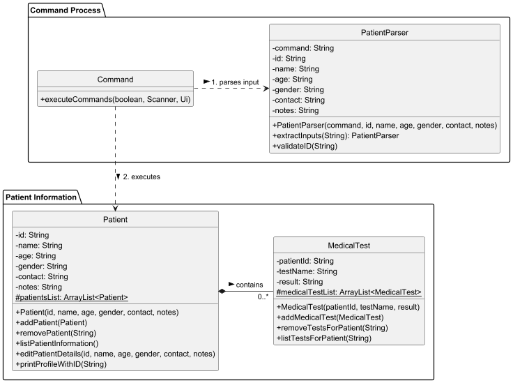
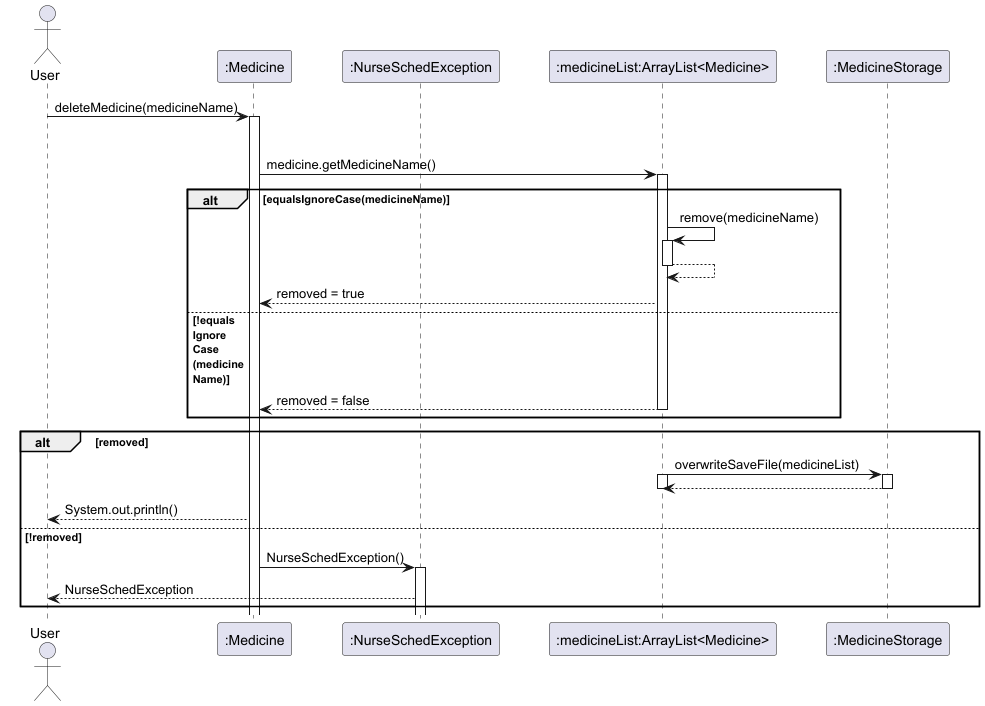
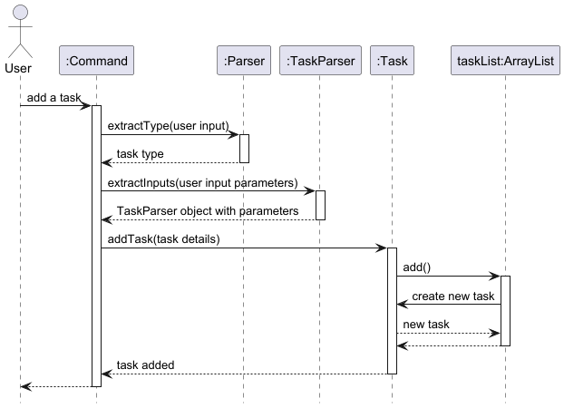
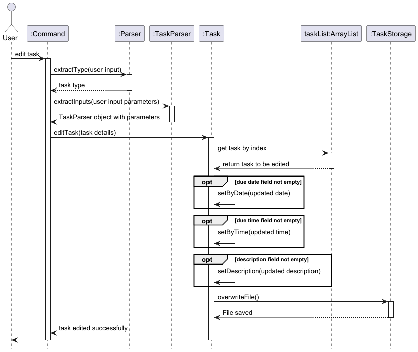
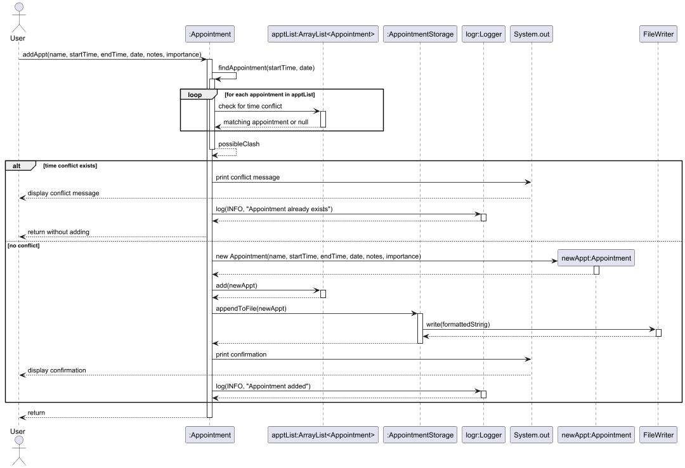
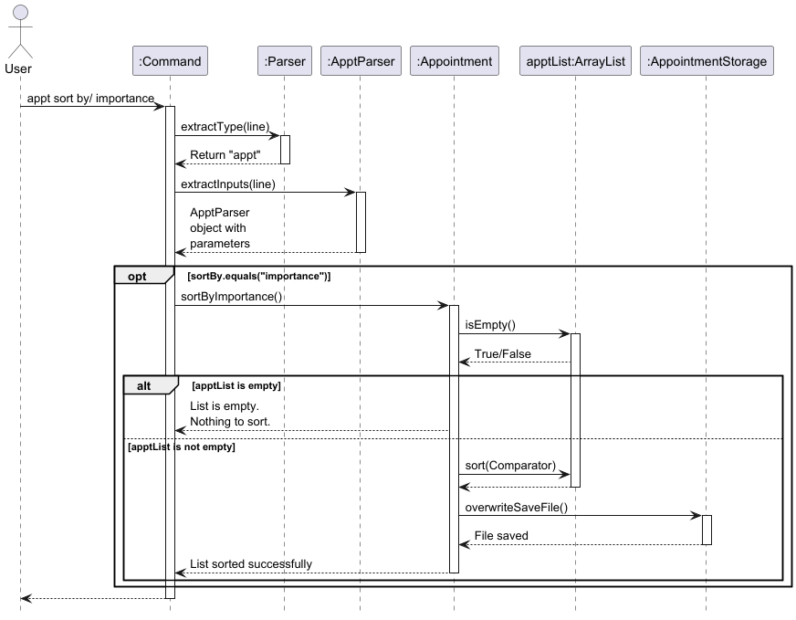

# Developer Guide

* [Acknowledgements](#acknowledgements)
* [Setting up, getting started](#setting-up-getting-started)
* [Design](#design)
  * [UI component](#ui-component)
  * [Storage component](#storage-component)
  * [Patient component](#patient-component)
  * [Common classes](#common-classes)
* [Implementation](#implementation)
  * [Patient delete feature](#patient-delete-feature)
  * [Medicine delete feature](#medicine-delete-feature)
  * [Task edit feature](#task-edit-feature)
  * [Appointment sort by importance feature](#appointment-sort-by-importance-feature)
* [Appendix: Requirements](#appendix-requirements)
  * [Product scope](#product-scope)
  * [User stories](#user-stories)
  * [Non-Functional Requirements](#non-functional-requirements)
  * [Glossary](#glossary)
* [Appendix: Instructions for manual testing](#appendix-instructions-for-manual-testing)
  * [Task List](#task-list)
  * [Shift List](#shift-list)
  * [Patient List](#patient-list)
  * [Appointment List](#appointment-list)
  * [Medicine List](#medicine-list)
  * [Handling missing/corrupted data files](#handling-missingcorrupted-data-files)
  * [Data Persistence](#data-persistence)
* [FAQ](#faq)

## Acknowledgements

NurseSched makes use of these tools:
1. [Gradle](https://gradle.org/): For build automation and code formatting checks.
2. [JUnit 5](https://junit.org/junit5/docs/current/user-guide/): For unit testing.
3. [Java Standard Library](https://docs.oracle.com/javase/8/docs/api/): For date time handling and file operations.

## Setting up, getting started
First, fork this repo, and clone the fork into your computer.

If you plan to use Intellij IDEA (highly recommended):

1. **Configure the JDK:** Follow the guide
[se-edu/guides IDEA: Configuring the JDK](https://se-education.org/guides/tutorials/intellijJdk.html) to ensure Intellij is configured to use JDK 17.
2. **Import the project as a Gradle project:** Follow the guide [se-edu/guides IDEA: Importing a Gradle project](https://se-education.org/guides/tutorials/intellijImportGradleProject.html)
to import the project into IDEA.
Note: Importing a Gradle project is slightly different from importing a normal Java project.
3. **Verify the setup:**
   1. Run the seedu.NurseSched.Main and try a few commands.
   2. Run the tests to ensure they all pass.

## Design

### UI component

API: `Ui.java`

[//]: # (todo: insert Ui diagram & add details)
[//]: # (to be implemented in v2.1)

### Storage component

API: `Storage.java`

[//]: # (todo: add storage class & insert Storage diagram)
[//]: # (to be implemented in v2.1)

The `Storage` component,

- can save the appointments list and medicine supply data in txt format, and read them back into the corresponding
  objects.
- depends on some classes in the `Appointment` and `Medicine` component (because the `Storage` components' job is to
  save/retrieve objects that belong to `Appointment` and `Medicine`)

### Patient component

API: `Patient.java`



The `Patient` component,

- Manages patient information including ID, name, age, gender, contact information, and medical notes.
- Enforces data integrity through validation rules (4-digit numeric ID, M/F gender restriction).
- Handles deletion by automatically removing associated medical tests.
- Maintains a static list (patientsList) as the single source of truth for all patient records.
- Throws custom exceptions (NurseSchedException) for error handling.

### Common classes

Classes used by multiple components are in:

- `seedu.nursesched.exception` package

## Implementation

This section describes some noteworthy details on how certain features are implemented.

### Patient delete feature

#### Implementation

The `removePatient` method is responsible for deleting a specific patient from the patient list based on their unique 
ID. The implementation follows these steps:

1. Assertion Check: The method first verifies that the provided id is not null using an assertion. This ensures the 
method fails fast if invalid input is provided.

2. Patient Search & Removal: The method iterates through the patientsList to find a patient with a matching ID. If 
found:
   - The patient is removed from the list. 
   - A confirmation message is printed. 
   - The loop breaks after removal to optimize performance. 

3. Failure Handling: If no patient is found with the specified ID, a `NurseSchedException` is thrown with the 
appropriate error message.

Given below is an example usage scenario and how the removal mechanism behaves at each step.

Step 1. The user launches the application. The patientsList is initialized, either empty or populated from saved data.

Step 2. The user adds patients using the addPatient method. For example:

```Patient("1234", "John Doe", "30", "M", "91234567", "Allergic to penicillin")```

Step 3. The user decides to remove a patient by calling removePatient("1234").

Step 4. The system:

- Validates the ID is not null. 
- Searches for a patient with ID "1234". 
- Removes the patient if found and prints:
  - ```Patient information removed for ID: 1234```

Step 5. If the ID does not exist (e.g., "9999"), the system throws:

```NurseSchedException: Patient not found.```

Step 6. The CLI displays the outcome (success or error) to the user.

The following sequence diagram shows how the delete patient information goes:


#### Design Considerations

Aspect: How patient removal executes:

- Alternative 1 (Current Choice): Remove by iterating through the list and comparing IDs. 
  - Pros: Simple to implement and understand. Works well for small to medium-sized lists. 
  - Cons: Inefficient for very large lists.
- Alternative 2: Use a HashMap<String, Patient>. 
  - Pros: Faster deletion for large datasets. 
  - Cons: Adds memory overhead and requires maintaining both a list and a map for other operations (e.g., listing 
  patients).

Justification: The current choice (iterative removal) balances simplicity and performance for the expected scale of the 
application. If the patient list grows significantly, other alternatives should be reconsidered.

### Medicine delete feature

#### Implementation

The `deleteMedicine` method is responsible for deleting a specific medicine from the medicine list. The implementation
follows these steps:

1. Assertion and Logging: The method first checks if the `medicineName` is not null, throwing an assertion error if it
   is. It then logs an informational message about the attempt to delete the specified medicine.
2. Medicine removal: It uses the `removeIf` method to attempt to remove a medicine from the `medicineList` by comparing
   the name of each medicine (ignoring case). If the medicine is found and removed, ti proceeds to overwrite the save
   file with the updated list.
3. Failure handling: If no medicine matching the given name is found, it logs a warning and throws a
   `NurseSchedException` with the appropriate error message.

Given below is an example usage scenario and how the delete medicine mechanism behaves at each step.

Step 1. The user launches the application for the first time. The `medicineList` will be initialized with the medicine
data stored (if exists).


Step 2. The user then adds a medicine using the `addMedicine` operation. If successful, the system logs the addition
and updates the saved file to reflect the change.

Step 3. The user then realised that the medicine has expired, thus she needs to delete it from the medicine supply list.
The user initiates the deletion of a medicine by calling the `deleteMedicine` function with the name of the medicine
to be deleted.



Step 4. The system attempts to find and remove the specified medicine from the list. If successful, the system logs the
deletion and updates the saved file to reflect the change.

Step 5. If the medicine is not found in the list, the system logs a warning and throws a custom exception,
`NurseSchedException`, with a relevant message indicating that the medicine does not exist.

Step 6. The system outputs a confirmation message or an error based on whether the medicine was successfully deleted or
not.

#### Design considerations

Aspect: How delete medicine executes:

- Alternative 1 (current choice): Perform a case-sensitive comparison for medicine name deletion.
    - Pros: Ensures that only the exact medicine name is removed.
    - Cons: May lead to issues where users input medicine names with different capitalizations.
- Alternative 2: Remove the medicine by other unique identifiers like a medicine ID.
    - Pros: Ensure precise deletion, particularly if multiple medicines share similar names.
    - Cons: Requires the medicine to have a unique identifier in the system, adding complexity

### Task edit feature

#### Implementation

The `editTask` method is responsible for editing a specific task from the task list. The implementation
follows these steps:

1. Assertion and Logging: The method first checks if the `index` is greater than 0, throwing an assertion error if it
   is. It then logs an informational message about the attempt to edit the task with the specified index.
2. Error Handling: It throws a `NurseSchedException` with the appropriate error message if any of the following occur:
   - `index` is not within 1 and the total number of tasks in the list of tasks
   - The updated due `byDate` and `byTime` is before the current date and time
3. Editing the task: It makes use of the appropriate setter methods to update the task with its new details. At least
   one of the optional fields must be provided.
   Given below is an example usage scenario and how the edit task mechanism behaves at each step.

Given below is an example usage scenario and how the delete medicine mechanism behaves at each step.

Step 1. The user launches the application for the first time. The `taskList` will be initialized with the task
data stored (if exists).

Step 2. The user then adds a task using the `addTask` operation. If successful, the system logs the addition
and updates the saved file to reflect the change.



Step 3. The user then realised that some task details were incorrect, thus she needs to edit it from the task list.
The user initiates the editing of a task by calling the `editTask` function with the index of the task to be edited.

Step 4. The system attempts to edit the specified task from the list. If unsuccessful, the system logs a warning and 
throws a custom exception, `NurseSchedException`, with a relevant message indicating the specific error.

Step 5. If successful, the system logs the edit and updates the saved file to reflect the changes.

Step 6. The system outputs a confirmation message or an error based on whether the task was successfully edited or
not.



#### Design considerations

Aspect: How edit task executes:

- Alternative 1 (current choice): Only 1 field is required to be edited, the rest are optional.
    - Pros: Gives the user flexibility as they can choose to edit only certain details of the task.
    - Cons: More error checks required.
- Alternative 2: Edits every detail of the task.
    - Pros: Standardized command that users can follow strictly.
    - Cons: Redundant fields still needed although the user does not need to edit those details of the task.

### Appointment sort by importance feature

#### Implementation

The `sortAppointmentByImportance` method is responsible for sorting all appointments in the appointment list. The implementation
follows these steps:

1. Validation and Logging: The method first checks if the apptList is empty. If it is, a warning message is logged, 
    and a NurseSchedException is thrown to indicate that there are no appointments to sort.
2. Sorting Mechanism: The list is sorted using a comparator that prioritizes: 
   1. Importance level (HIGH to LOW)
   2. Date (earliest to latest)
   3. Start time (earliest to latest)
3. Saving Updated List: After sorting, the method overwrites the save file to ensure the changes persist. 
4. Logging Completion: An informational log entry is created to confirm that the sorting was successful.

Given below is an example usage scenario and how the sorting mechanism behaves at each step.


Step 1. The user launches the application for the first time. The `apptList` will be initialized
with stored appointment data (if exists).

Step 2. The user adds multiple appointments using the addAppointment operation. If successful, 
the system logs the addition and updates the saved file.



Step 3. The user decides to sort the appointments by importance to prioritize critical tasks. 
The user initiates sorting by calling the sortByImportance function.



Step 4. The system checks if the apptList is empty. If it is, a warning is logged, and an exception is thrown.

Step 5. If appointments exist, the system sorts them based on importance (HIGH to LOW), followed by date and start time.

Step 6. The system overwrites the saved file to reflect the sorted list.

Step 7. The system outputs a confirmation message indicating that appointments have been successfully sorted.

#### Design considerations

Aspect: How appointment sorting by importance executes:

- Alternative 1 (current choice): Appointment list is only sorted when method is called manually by user.
    - Pros: 
      - Better performance for large lists
      - More predictable behavior for users
    - Cons: 
      - Requires users to remember to resort after changes
      - List may become unsorted without user awareness
- Alternative 2: Automatically resort list after appointments are added, deleted or edited.
    - Pros: 
      - Always maintains the sorted order
      - User doesn't need to manually resort
    - Cons:
      - Performance impact for large lists
      - May be confusing for the user if appointments keep changing position

# Appendix: Requirements

## Product scope

### Target user profile:

- nurses working in hospitals
- have shifts, schedules, patients profiles, medicine supplies and appointments to manage
- can type fast
- prefer desktop apps over other types
- is reasonably comfortable using CLI apps
- prefers typing to mouse interaction

### Value proposition

We want to help nurses organise different lists faster than a typical mouse/GUI driven app or digging out
information from many different sources.
This is so that they can retrieve information quickly, especially with how hectic their schedules are.

## User Stories

| Version | As a ... | I want to ...                                                       | So that I can ...                                                      |
|---------|----------|---------------------------------------------------------------------|------------------------------------------------------------------------|
| v2.0    | Nurse    | Search for a patient's profile                                      | I can locate the patient's details easily                              |
| v2.0    | Nurse    | Edit patient's information                                          | I can fix any incorrect information                                    |
| v2.0    | Nurse    | Add more fields for patient information like patient ID, gender etc | I can keep track of additional information relating to the patient     |
| v2.0    | Nurse    | Input medical test results                                          | I am aware of the conditions of my patients                            |
| v2.0    | Nurse    | Delete medical test results                                         | I am able to fix any errors in the test results                        |
| v2.0    | Nurse    | Check patient's medical tests                                       | I can quickly retrieve test results for my patients                    |
| v2.0    | Nurse    | Save patients information                                           | I can keep track and load patient information after exiting NurseSched |
| v2.0    | Nurse    | Add tasks to my todo list                                           | keep track of my things to do                                          |
| v2.0    | Nurse    | List out my tasks                                                   | I can view all the things to be completed                              |
| v2.0    | Nurse    | Check off things from my to-do list                                 | I know which tasks have been completed                                 |
| v2.0    | Nurse    | Delete my tasks                                                     | I can remove irrelevant tasks                                          |
| v2.0    | Nurse    | Edit my to-do list                                                  | I can fill it with updated information that I need to keep track of    |
| v2.0    | Nurse    | Search for a task                                                   | I can locate a specific task with a keyword                            |
| v2.0    | Nurse    | Save my task list                                                   | I can load and save my existing task list                              |
| v2.0    | Nurse    | add in an amount of medicine to the list                            | update my medicine supply                                              |
| v2.0    | Nurse    | remove an amount of medicine from the list                          | update my medicine supply                                              |
| v2.0    | Nurse    | search for a specific medicine from the list                        | see how much of the medicine I have left                               |
| v2.0    | Nurse    | edit the information of the medicine                                | ensure that my medicine supply is up-to-date                           |
| v2.0    | Nurse    | delete a specific medicine                                          | entirely remove a medicine from the list                               |
| v2.0    | Nurse    | view the total supply of medicine left                              | know what needs to be restocked                                        |
| v2.0    | Nurse    | save the medicine supply list                                       | keep track of the supply                                               |
| v2.0    | Nurse    | search for an appointment                                           | filter the list of appointments                                        |
| v2.0    | Nurse    | edit appointment dates and time                                     | update my schedule                                                     |
| v2.0    | Nurse    | arrange appointments in chronological order                         | view my upcoming appointments first                                    | 
| v2.0    | Nurse    | save appointment information                                        | retrieve previously stored appointment information                     | 
| v2.0    | Nurse    | rank importance of appointments                                     | arrange my appointments based off priority                             |
| v2.0    | Nurse    | list medicine that is below a certain quantity                      | know which medicine to restock                                         |

## Non-Functional Requirements

1. Should work on any *mainstream* OS as long as it has Java `17` installed.
2. A user with above average typing speed for regular English text should be able to accomplish most of the tasks faster
using commands than using the mouse.

## Glossary

* **Mainstream OS** - Windows, Linux, macOS

# Appendix: Instructions for manual testing

## Manual Testing

### Introduction
This section provides instructions for testing the various features of NurseSched manually. The tests are organized by feature and include both valid and invalid test cases to verify correct behavior.

### Initial Launch
1. Download the NurseSched JAR file and copy it into an empty folder.
2. Start the application by using `java -jar nursesched.jar` in the terminal.
3. Verify that the welcome message is displayed and the application is ready to accept commands.

## Task List

### Adding a task
**Prerequisites**: List all tasks using the `task list` command. Initially, no tasks in the list.

**Test case**: `task add td/Prepare tools d/2025-07-15 t/13:00`  
**Expected**: Task is added to the list. Details of the added task shown in the status message. Task list now contains 1 task.

**Test case**: `task add` (without description, date and time)  
**Expected**: No task is added. Error details shown in the status message. Task list remains empty.

**Other incorrect add commands to try**:
- `task add td/Prepare tools` (missing date and time)
- `task add d/2025-07-15` (missing description and time)
- `task add td/Prepare tools d/2025-07-15` (missing time)
- `task add td/Prepare tools t/13:00` (missing date)
- `task add td/Prepare tools d/ 2021-02-02 t/13:00` (date in the past)

**Expected**: Similar to previous error behavior.

### Deleting a task
**Prerequisites**: List all tasks using the `task list` command. At least one task in the list.

**Test case**: `task del id/1`  
**Expected**: First task is deleted. Status message indicates successful deletion. The task deleted does not exist in the list anymore.

**Test case**: `task del id/0`  
**Expected**: No task is deleted. Error details shown in the status message.

**Test case**: `task del id/100` (assuming there are fewer than 100 tasks)  
**Expected**: No task is deleted. Error details shown in the status message.

**Test case**: `task del id/-1`
**Expected**: No task is deleted. Error details shown in the status message.

### Marking a task
**Prerequisites**: List all tasks using the `task list` command. At least one task in the list.

**Test case**: `task mark id/1`  
**Expected**: First task is marked as completed. Status message indicates successful marking. Task list shows the task with completed status.

**Test case**: `task mark id/0`  
**Expected**: No task is marked. Error details shown in the status message. Task status remains unchanged.

**Test case**: `task mark id/100` (assuming there are fewer than 100 tasks)  
**Expected**: No task is marked. Error details shown in the status message. Task status remains unchanged.

**Test case**: `task mark id/-1`
**Expected**: No task is marked. Error details shown in the status message. Task status remains unchanged.

### Unmarking a task
**Prerequisites**: List all tasks using the `task list` command. At least one task marked as completed in the list.

**Test case**: `task unmark id/1` (assuming first task is marked as completed)  
**Expected**: First task is unmarked. Status message indicates successful unmarking. Task list shows the task with uncompleted status.

**Test case**: `task unmark id/0`  
**Expected**: No task is unmarked. Error details shown in the status message. Task status remains unchanged.

**Test case**: `task unmark id/-1`
**Expected**: No task is unmarked. Error details shown in the status message. Task status remains unchanged.

### Editing a task
**Prerequisites**: List all tasks using the `task list` command. At least one task in the list.

**Test case**: `task edit id/1 td/Update medicine supply t/13:00`  
**Expected**: First task's description and time are updated. Status message shows successful update. Task list reflects the changes.

**Test case**: `task edit id/0 td/New description`  
**Expected**: No task is edited. Error details shown in the status message. Task list remains unchanged.

**Other incorrect edit commands to try**:
- `task edit` (missing all parameters)
- `task edit id/0` (invalid task index)

**Expected**: Similar to previous error behavior.

### Finding a task
**Prerequisites**: List all tasks using the `task list` command. At least one task has a description with the word "Jean".

**Test case**: `task find td/Jean`  
**Expected**: All tasks with "Jean" in the description is displayed. Total number of such tasks also shown.

**Test case**: `task find Jean` (missing field)  
**Expected**: Message indicating invalid command.

### Listing all tasks
**Test case**: `task list` (with no tasks)  
**Expected**: Message indicating that the task list is empty.

**Test case**: `task list` (after adding multiple tasks)  
**Expected**: List displays all tasks with their completion status, due date, and time, as well as total number of tasks in the list currently.

## Shift List

### Adding a shift
**Prerequisites**: List all shifts using the `shift list` command. Initially, no shifts in the list.

**Test case**: `shift add s/08:00 e/12:00 d/2025-04-10 st/Morning ward round`  
**Expected**: Shift is added to the list. Details of the added shift shown in the status message. Shift list now contains 1 shift.

**Test case**: `shift add` (without all required parameters)  
**Expected**: No shift is added. Error details shown in the status message. Shift list remains empty.

**Other incorrect add commands to try**:
- `shift add s/08:00` (missing end time, date, and task)
- `shift add s/08:00 e/12:00` (missing date and task)
- `shift add s/08:00 e/12:00 d/2025-04-10` (missing task)

**Expected**: Similar to previous error behavior.

### Editing a shift
**Prerequisites**: List all shifts using the `shift list` command. At least one shift in the list.

**Test case**: `shift edit id/1 s/14:00 e/18:00 d/2025-04-12 st/Afternoon ER duty`  
**Expected**: First shift is updated with new details. Status message indicates successful update. Shift list reflects the changes.

**Test case**: `shift edit id/0 s/14:00 e/18:00 d/2025-04-12 st/Afternoon ER duty`  
**Expected**: No shift is edited. Error details shown in the status message. Shift list remains unchanged.

### Marking a shift
**Prerequisites**: List all shifts using the `shift list` command. At least one shift in the list that is not completed.

**Test case**: `shift mark id/1`  
**Expected**: First shift is marked as completed. Status message indicates successful marking. Shift list shows the shift with completed status.

**Test case**: `shift mark id/0`  
**Expected**: No shift is marked. Error details shown in the status message. Shift status remains unchanged.

### Unmarking a shift
**Prerequisites**: List all shifts using the `shift list` command. At least one shift marked as completed in the list.

**Test case**: `shift unmark id/1` (assuming first shift is marked as completed)  
**Expected**: First shift is unmarked. Status message indicates successful unmarking. Shift list shows the shift with uncompleted status.

**Test case**: `shift unmark id/0`  
**Expected**: No shift is unmarked. Error details shown in the status message. Shift status remains unchanged.

### Deleting a shift
**Prerequisites**: List all shifts using the `shift list` command. At least one shift in the list.

**Test case**: `shift del id/1`  
**Expected**: First shift is deleted from the list. Details of the deleted shift shown in the status message. Shift list now contains one fewer shift.

**Test case**: `shift del id/0`  
**Expected**: No shift is deleted. Error details shown in the status message. Shift list remains unchanged.

### Listing all shifts
**Test case**: `shift list` (with no shifts)  
**Expected**: Message indicating that the shift list is empty.

**Test case**: `shift list` (after adding multiple shifts)  
**Expected**: List displays all shifts with their completion status, date, time range, and task.

## Patient List

### Adding a patient profile
**Prerequisites**: List all patient profiles using the `pf list` command. Initially, no patient profiles in the list.

**Test case**: `pf add id/1001 p/Jean a/25 g/F c/66887799 n/requires constant supervision`  
**Expected**: Patient profile is added to the list. Details of the added profile shown in the status message. Patient list now contains 1 profile.

**Test case**: `pf add` (without all required parameters)  
**Expected**: No patient profile is added. Error details shown in the status message. Patient list remains empty.

**Other incorrect add commands to try**:
- `pf add id/1001` (missing other required fields)
- `pf add id/1001 p/Jean` (missing age, gender, contact and notes)
- `pf add id/10011 p/Jean a/25 g/F c/66887799 n/requires constant supervision` (ID number more than 4 digits)

**Expected**: Similar to previous error behavior.

### Deleting a patient profile
**Prerequisites**: List all patient profiles using the `pf list` command. At least one patient profile in the list.

**Test case**: `pf del id/1001` (assuming this ID exists)  
**Expected**: Patient profile with ID 1001 is deleted from the list. Details of the deleted profile shown in the status message. Patient list now contains one fewer profile.

**Test case**: `pf del id/9999` (assuming this ID doesn't exist)  
**Expected**: No patient profile is deleted. Error details shown in the status message. Patient list remains unchanged.

### Searching for a patient profile
**Prerequisites**: List all patient profiles using the `pf list` command. At least one patient profile in the list.

**Test case**: `pf find id/1001` (assuming this ID exists)  
**Expected**: Displays the patient profile with ID 1001.

**Test case**: `pf find id/9999` (assuming this ID doesn't exist)  
**Expected**: Message indicating that no patient profile with the specified ID was found.

### Listing all patient profiles
**Test case**: `pf list` (with no patient profiles)  
**Expected**: Message indicating that the patient list is empty.

**Test case**: `pf list` (after adding multiple patient profiles)  
**Expected**: List displays all patient profiles with their details.

### Editing a patient profile
**Prerequisites**: List all patient profiles using the `pf list` command. At least one patient profile in the list.

**Test case**: `pf edit id/1001 p/Jean a/22 g/F c/12345678 n/Allergic to peanuts` (assuming ID 1001 exists)  
**Expected**: Patient profile with ID 1001 is updated with new details. Status message indicates successful update. Patient list reflects the changes.

**Test case**: `pf edit id/9999 p/Jean` (assuming ID 9999 doesn't exist)  
**Expected**: No patient profile is edited. Error details shown in the status message. Patient list remains unchanged.

### Medical Test Results

**Test case**: `pf result add id/1001 t/X-Ray r/Fractures found.` (assuming ID 1001 exists)  
**Expected**: Medical test result is added to the patient profile. Status message indicates successful addition.

**Test case**: `pf result add id/9999 t/X-Ray r/Fractures found.` (assuming ID 9999 doesn't exist)  
**Expected**: No medical test result is added. Error details shown in the status message.

**Test case**: `pf result del id/1001` (assuming ID 1001 exists and has test results)  
**Expected**: All medical test results for patient with ID 1001 are deleted. Status message indicates successful deletion.

**Test case**: `pf result list id/1001` (assuming ID 1001 exists and has test results)  
**Expected**: Displays all medical test results for patient with ID 1001.

## Appointment List

### Adding an appointment
**Prerequisites**: List all appointments using the `appt list` command. Initially, no appointments in the list.

**Test case**: 
* Add patient profile into patients list: `pf add id/1001 p/Jean a/25 g/F c/66887799 n/requires constant supervision`  
* Add appointment for that patient: `appt add p/Jean Doe s/13:00 e/14:00 d/2025-02-12 im/2 n/super healthy`  

**Expected**: Appointment is added to the list. Details of the added appointment shown in the status message. Appointment list now contains 1 appointment.

**Test case**: `appt add` (without all required parameters)  
**Expected**: No appointment is added. Error details shown in the status message. Appointment list remains empty.

**Other incorrect add commands to try**:
- `appt add p/Jean Doe` (missing start time, end time, date, importance, and notes)
- `appt add p/Jean Doe s/13:00 e/14:00` (missing date, importance, and notes)
- `appt add p/Jean Doe s/13:00 e/14:00 d/2025-02-12 im/5 n/super healthy` (importance value out of range)

**Expected**: Similar to previous error behavior.

### Deleting an appointment
**Prerequisites**: List all appointments using the `appt list` command. At least one appointment in the list.

**Test case**: `appt del id/1`  
**Expected**: First appointment is deleted from the list. Details of the deleted appointment shown in the status message. Appointment list now contains one fewer appointment.

**Test case**: `appt del id/0`  
**Expected**: No appointment is deleted. Error details shown in the status message. Appointment list remains unchanged.

### Marking an appointment
**Prerequisites**: List all appointments using the `appt list` command. At least one appointment in the list that is not completed.

**Test case**: `appt mark id/1`  
**Expected**: First appointment is marked as completed. Status message indicates successful marking. Appointment list shows the appointment with completed status.

**Test case**: `appt mark id/0`  
**Expected**: No appointment is marked. Error details shown in the status message. Appointment status remains unchanged.

### Unmarking an appointment
**Prerequisites**: List all appointments using the `appt list` command. At least one appointment marked as completed in the list.

**Test case**: `appt unmark id/1` (assuming first appointment is marked as completed)  
**Expected**: First appointment is unmarked. Status message indicates successful unmarking. Appointment list shows the appointment with uncompleted status.

**Test case**: `appt unmark id/0`  
**Expected**: No appointment is unmarked. Error details shown in the status message. Appointment status remains unchanged.

### Editing an appointment
**Prerequisites**: List all appointments using the `appt list` command. At least one appointment in the list.

**Test case**: `appt edit id/1 p/edited name s/13:00 e/15:00`  
**Expected**: First appointment's patient name, start time, and end time are updated. Status message shows successful update. Appointment list reflects the changes.

**Test case**: `appt edit id/0 im/1`  
**Expected**: No appointment is edited. Error details shown in the status message. Appointment list remains unchanged.

### Searching for an appointment
**Prerequisites**: List all appointments using the `appt list` command. Multiple appointments in the list.

**Test case**: `appt find Jean Doe` (assuming there's an appointment with this patient name)  
**Expected**: Displays all appointments for patient "Jean Doe".

**Test case**: `appt find Unknown Patient` (assuming there's no appointment with this patient name)  
**Expected**: Message indicating that no appointments were found for the specified patient.

### Sorting appointments
**Prerequisites**: List all appointments using the `appt list` command. Multiple appointments in the list with different importance levels and times.

**Test case**: `appt sort by/ time`  
**Expected**: Appointments are sorted chronologically. Status message indicates successful sorting.

**Test case**: `appt sort by/ importance`  
**Expected**: Appointments are sorted by importance level (high to low). Status message indicates successful sorting.

## Medicine List

### Adding a medicine quantity
**Prerequisites**: List all medicines using the `medicine list` command. Initially, no medicines in the list or paracetamol doesn't exist.

**Test case**: `medicine add mn/paracetamol q/2`  
**Expected**: Medicine is added to the list or quantity is increased by 2. Status message indicates successful addition.

**Test case**: `medicine add` (without all required parameters)  
**Expected**: No medicine is added. Error details shown in the status message. Medicine list remains unchanged.

### Removing a medicine quantity
**Prerequisites**: List all medicines using the `medicine list` command. At least one medicine with sufficient quantity in the list.

**Test case**: `medicine remove mn/paracetamol q/2` (assuming paracetamol exists with quantity ≥ 2)  
**Expected**: Quantity of paracetamol is decreased by 2. Status message indicates successful removal.

**Test case**: `medicine remove mn/unknown q/2` (assuming this medicine doesn't exist)  
**Expected**: No medicine quantity is removed. Error details shown in the status message. Medicine list remains unchanged.

### Finding a medicine
**Prerequisites**: List all medicines using the `medicine list` command. At least one medicine in the list.

**Test case**: `medicine find mn/paracetamol` (assuming paracetamol exists)  
**Expected**: Displays paracetamol with its quantity.

**Test case**: `medicine find mn/unknown` (assuming this medicine doesn't exist)  
**Expected**: Message indicating that the specified medicine was not found.

### Deleting a medicine
**Prerequisites**: List all medicines using the `medicine list` command. At least one medicine in the list.

**Test case**: `medicine delete mn/paracetamol` (assuming paracetamol exists)  
**Expected**: Paracetamol is deleted from the list. Status message indicates successful deletion.

**Test case**: `medicine delete mn/unknown` (assuming this medicine doesn't exist)  
**Expected**: No medicine is deleted. Error details shown in the status message. Medicine list remains unchanged.

### Editing a medicine
**Prerequisites**: List all medicines using the `medicine list` command. At least one medicine in the list.

**Test case**: `medicine edit mn/paracetamo un/paracetamol uq/4` (assuming "paracetamo" exists)  
**Expected**: Medicine name is updated from "paracetamo" to "paracetamol" and quantity is updated to 4. Status message indicates successful update.

**Test case**: `medicine edit mn/unknown un/new_name uq/10` (assuming this medicine doesn't exist)  
**Expected**: No medicine is edited. Error details shown in the status message. Medicine list remains unchanged.

### Restocking a medicine
**Prerequisites**: List all medicines using the `medicine list` command. Multiple medicines in the list with different quantities.

**Test case**: `medicine restock q/30`  
**Expected**: Displays all medicines with quantity less than 30. Status message indicates successful operation.

## Handling missing/corrupted data files
To simulate a missing or corrupted data file:

1. Delete or rename the data files used by NurseSched (in the `/data/` folder).
2. Run NurseSched and attempt to perform operations.

**Expected behavior**:
- NurseSched should handle the absence or corruption of the data files gracefully.
- It should either create new data files or display an error message indicating the problem.

## Data Persistence
To test data persistence:

1. Add several tasks, shifts, patient profiles, appointments, and medicines.
2. Exit the application using a proper exit command.
3. Restart the application.

**Expected behavior**:
- All previously added data should be loaded and displayed correctly.

## FAQ

**Q**: How do I transfer my data to another computer?
**A**: All the data is stored in the `/data/` folder. Simply transfer this folder to the other computer.

## Additional Test Cases

### Invalid Commands
Test various invalid commands to ensure that the application responds correctly with error messages:
- Commands with incorrect syntax
- Commands with missing required parameters
- Commands with invalid parameter values

### Edge Cases
Test edge cases such as:
- Adding, editing, marking, or deleting tasks, shifts, appointments when the respective list is empty
- Adding a patient profile with an ID that already exists
- Removing a medicine quantity that exceeds the available quantity
