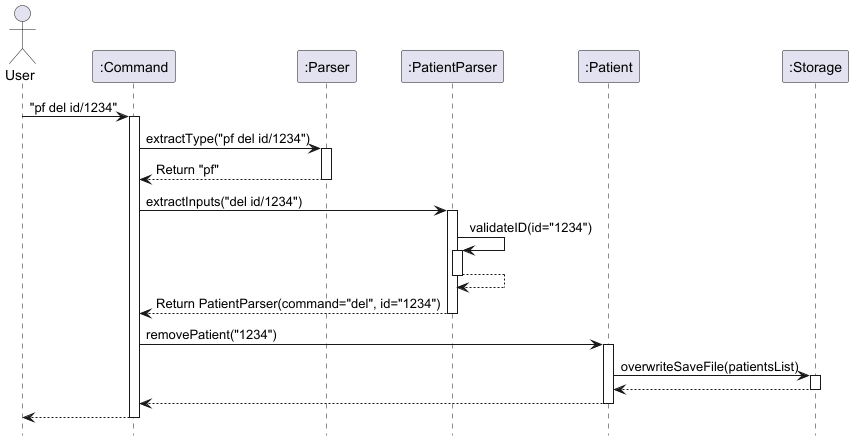
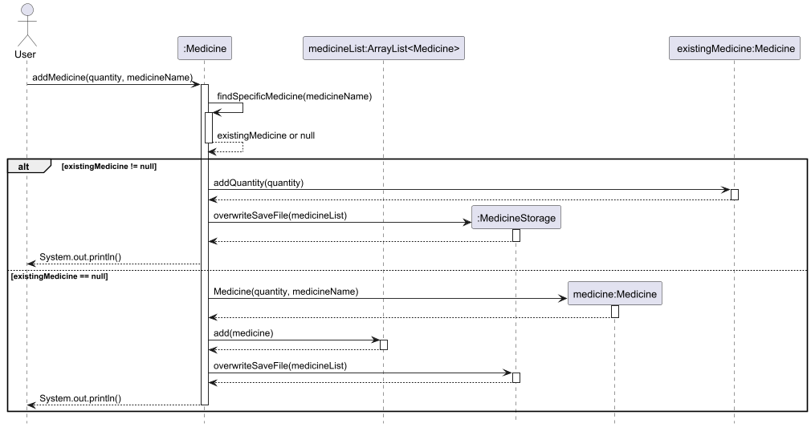
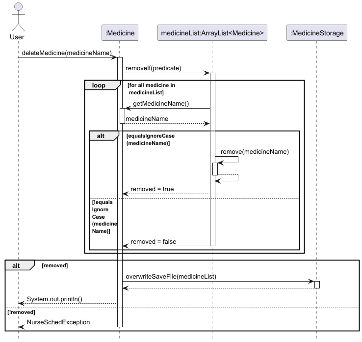

# Developer Guide

## Acknowledgements

NurseSched makes use of these tools:
1. [Gradle](https://gradle.org/): For build automation and code formatting checks.
2. [JUnit 5](https://junit.org/junit5/docs/current/user-guide/): For unit testing.
3. [Java Standard Library](https://docs.oracle.com/javase/8/docs/api/): For date time handling and file operations.

## Design

### UI component

API: `Ui.java`

[//]: # (todo: insert Ui diagram & add details)

### Storage component

API: `Storage.java`

[//]: # (todo: add storage class & insert Storage diagram)

The `Storage` component,

- can save the appointments list and medicine supply data in txt format, and read them back into the corresponding
  objects.
- depends on some classes in the `Appointment` and `Medicine` component (because the `Storage` components' job is to
  save/retrieve objects that belong to `Appointment` and `Medicine`)

### Patient component

API: `Patient.java`


The `Patient` component,

- Manages patient information including ID, name, age, gender, contact information, and medical notes.
- Enforces data integrity through validation rules (4-digit numeric ID, M/F gender restriction).
- Handles deletion by automatically removing associated medical tests.
- Maintains a static list (patientsList) as the single source of truth for all patient records.
- Throws custom exceptions (NurseSchedException) for error handling.

### Common classes

Classes used by multiple components are in:

- `seedu.nursesched.exception` package

## Implementation

This section describes some noteworthy details on how certain features are implemented.

### Patient delete feature

#### Implementation

The `removePatient` method is responsible for deleting a specific patient from the patient list based on their unique 
ID. The implementation follows these steps:

1. Assertion Check: The method first verifies that the provided id is not null using an assertion. This ensures the 
method fails fast if invalid input is provided.

2. Patient Search & Removal: The method iterates through the patientsList to find a patient with a matching ID. If 
found:
   - The patient is removed from the list. 
   - A confirmation message is printed. 
   - The loop breaks after removal to optimize performance. 

3. Failure Handling: If no patient is found with the specified ID, a `NurseSchedException` is thrown with the 
appropriate error message.

Given below is an example usage scenario and how the removal mechanism behaves at each step.

Step 1. The user launches the application. The patientsList is initialized, either empty or populated from saved data.

Step 2. The user adds patients using the addPatient method. For example:

```Patient("1234", "John Doe", "30", "M", "91234567", "Allergic to penicillin")```

Step 3. The user decides to remove a patient by calling removePatient("1234").

Step 4. The system:

- Validates the ID is not null. 
- Searches for a patient with ID "1234". 
- Removes the patient if found and prints:
  - ```Patient information removed for ID: 1234```

Step 5. If the ID does not exist (e.g., "9999"), the system throws:

```NurseSchedException: Patient not found.```

Step 6. The CLI displays the outcome (success or error) to the user.

The following sequence diagram shows how the delete patient information goes:



#### Design Considerations

Aspect: How patient removal executes:

- Alternative 1 (Current Choice): Remove by iterating through the list and comparing IDs. 
  - Pros: Simple to implement and understand. Works well for small to medium-sized lists. 
  - Cons: Inefficient for very large lists.
- Alternative 2: Use a HashMap<String, Patient>. 
  - Pros: Faster deletion for large datasets. 
  - Cons: Adds memory overhead and requires maintaining both a list and a map for other operations (e.g., listing 
  patients).

Justification: The current choice (iterative removal) balances simplicity and performance for the expected scale of the 
application. If the patient list grows significantly, other alternatives should be reconsidered.

### Medicine delete feature

#### Implementation

The `deleteMedicine` method is responsible for deleting a specific medicine from the medicine list. The implementation
follows these steps:

1. Assertion and Logging: The method first checks if the `medicineName` is not null, throwing an assertion error if it
   is. It then logs an informational message about the attempt to delete the specified medicine.
2. Medicine removal: It uses the `removeIf` method to attempt to remove a medicine from the `medicineList` by comparing
   the name of each medicine (ignoring case). If the medicine is found and removed, ti proceeds to overwrite the save
   file with the updated list.
3. Failure handling: If no medicine matching the given name is found, it logs a warning and throws a
   `NurseSchedException` with the appropriate error message.

Given below is an example usage scenario and how the delete medicine mechanism behaves at each step.

Step 1. The user launches the application for the first time. The `medicineList` will be initialized with the medicine
data stored (if exists).



Step 2. The user then adds a medicine using the `addMedicine` operation. If successful, the system logs the addition
and updates the saved file to reflect the change.

Step 3. The user then realised that the medicine has expired, thus she needs to delete it from the medicine supply list.
The user initiates the deletion of a medicine by calling the `deleteMedicine` function with the name of the medicine
to be deleted.



Step 4. The system attempts to find and remove the specified medicine from the list. If successful, the system logs the
deletion and updates the saved file to reflect the change.

Step 5. If the medicine is not found in the list, the system logs a warning and throws a custom exception,
`NurseSchedException`, with a relevant message indicating that the medicine does not exist.

Step 6. The system outputs a confirmation message or an error based on whether the medicine was successfully deleted or
not.

#### Design considerations

Aspect: How delete medicine executes:

- Alternative 1 (current choice): Perform a case-sensitive comparison for medicine name deletion.
    - Pros: Ensures that only the exact medicine name is removed.
    - Cons: May lead to issues where users input medicine names with different capitalizations.
- Alternative 2: Remove the medicine by other unique identifiers like a medicine ID.
    - Pros: Ensure precise deletion, particularly if multiple medicines share similar names.
    - Cons: Requires the medicine to have a unique identifier in the system, adding complexity

### Task edit feature

#### Implementation

The `editTask` method is responsible for editing a specific task from the task list. The implementation
follows these steps:

1. Assertion and Logging: The method first checks if the `index` is greater than 0, throwing an assertion error if it
   is. It then logs an informational message about the attempt to edit the task with the specified index.
2. Error Handling: It throws a `NurseSchedException` with the appropriate error message if any of the following occur:
   - `index` is not within 1 and the total number of tasks in the list of tasks
   - The updated due `byDate` and `byTime` is before the current date and time
3. Editing the task: It makes use of the appropriate setter methods to update the task with its new details. At least
   one of the optional fields must be provided.
   Given below is an example usage scenario and how the edit task mechanism behaves at each step.

Given below is an example usage scenario and how the delete medicine mechanism behaves at each step.

Step 1. The user launches the application for the first time. The `taskList` will be initialized with the task
data stored (if exists).

Step 2. The user then adds a task using the `addTask` operation. If successful, the system logs the addition
and updates the saved file to reflect the change.


Step 3. The user then realised that some task details were incorrect, thus she needs to edit it from the task list.
The user initiates the editing of a task by calling the `editTask` function with the index of the task to be edited.

Step 4. The system attempts to edit the specified task from the list. If unsuccessful, the system logs a warning and 
throws a custom exception, `NurseSchedException`, with a relevant message indicating the specific error.

Step 5. If successful, the system logs the edit and updates the saved file to reflect the changes.

Step 6. The system outputs a confirmation message or an error based on whether the task was successfully edited or
not.


#### Design considerations

Aspect: How edit task executes:

- Alternative 1 (current choice): Only 1 field is required to be edited, the rest are optional.
    - Pros: Gives the user flexibility as they can choose to edit only certain details of the task.
    - Cons: More error checks required.
- Alternative 2: Edits every detail of the task.
    - Pros: Standardized command that users can follow strictly.
    - Cons: Redundant fields still needed although the user does not need to edit those details of the task.

### Appointment sort by importance feature

#### Implementation

The `sortAppointmentByImportance` method is responsible for sorting all appointments in the appointment list. The implementation
follows these steps:

1. Validation and Logging: The method first checks if the apptList is empty. If it is, a warning message is logged, 
    and a NurseSchedException is thrown to indicate that there are no appointments to sort.
2. Sorting Mechanism: The list is sorted using a comparator that prioritizes: 
   1. Importance level (HIGH to LOW)
   2. Date (earliest to latest)
   3. Start time (earliest to latest)
3. Saving Updated List: After sorting, the method overwrites the save file to ensure the changes persist. 
4. Logging Completion: An informational log entry is created to confirm that the sorting was successful.

Given below is an example usage scenario and how the sorting mechanism behaves at each step.


Step 1. The user launches the application for the first time. The `apptList` will be initialized
with stored appointment data (if exists).

Step 2. The user adds multiple appointments using the addAppointment operation. If successful, 
the system logs the addition and updates the saved file.


Step 3. The user decides to sort the appointments by importance to prioritize critical tasks. 
The user initiates sorting by calling the sortByImportance function.


Step 4. The system checks if the apptList is empty. If it is, a warning is logged, and an exception is thrown.

Step 5. If appointments exist, the system sorts them based on importance (HIGH to LOW), followed by date and start time.

Step 6. The system overwrites the saved file to reflect the sorted list.

Step 7. The system outputs a confirmation message indicating that appointments have been successfully sorted.

#### Design considerations

Aspect: How appointment sorting by importance executes:

- Alternative 1 (current choice): Appointment list is only sorted when method is called manually by user.
    - Pros: 
      - Better performance for large lists
      - More predictable behavior for users
    - Cons: 
      - Requires users to remember to resort after changes
      - List may become unsorted without user awareness
- Alternative 2: Automatically resort list after appointments are added, deleted or edited.
    - Pros: 
      - Always maintains the sorted order
      - User doesn't need to manually resort
    - Cons:
      - Performance impact for large lists
      - May be confusing for the user if appointments keep changing position


## Product scope

### Target user profile:

- nurses working in hospitals
- have shifts, schedules, patients profiles, medicine supplies and appointments to manage
- can type fast
- prefer desktop apps over other types
- is reasonably comfortable using CLI apps
- prefers typing to mouse interaction

### Value proposition

We want to help nurses organise different lists faster than a typical mouse/GUI driven app or digging out
information from many different sources.
This is so that they can retrieve information quickly, especially with how hectic their schedules are.

## User Stories

| Version | As a ... | I want to ...                                                       | So that I can ...                                                      |
|---------|----------|---------------------------------------------------------------------|------------------------------------------------------------------------|
| v2.0    | Nurse    | Search for a patient's profile                                      | I can locate the patient's details easily                              |
| v2.0    | Nurse    | Edit patient's information                                          | I can fix any incorrect information                                    |
| v2.0    | Nurse    | Add more fields for patient information like patient ID, gender etc | I can keep track of additional information relating to the patient     |
| v2.0    | Nurse    | Input medical test results                                          | I am aware of the conditions of my patients                            |
| v2.0    | Nurse    | Delete medical test results                                         | I am able to fix any errors in the test results                        |
| v2.0    | Nurse    | Check patient's medical tests                                       | I can quickly retrieve test results for my patients                    |
| v2.0    | Nurse    | Save patients information                                           | I can keep track and load patient information after exiting NurseSched |
| v2.0    | Nurse    | Add tasks to my todo list                                           | keep track of my things to do                                          |
| v2.0    | Nurse    | List out my tasks                                                   | I can view all the things to be completed                              |
| v2.0    | Nurse    | Check off things from my to-do list                                 | I know which tasks have been completed                                 |
| v2.0    | Nurse    | Delete my tasks                                                     | I can remove irrelevant tasks                                          |
| v2.0    | Nurse    | Edit my to-do list                                                  | I can fill it with updated information that I need to keep track of    |
| v2.0    | Nurse    | Search for a task                                                   | I can locate a specific task with a keyword                            |
| v2.0    | Nurse    | Save my task list                                                   | I can load and save my existing task list                              |
| v2.0    | Nurse    | add in an amount of medicine to the list                            | update my medicine supply                                              |
| v2.0    | Nurse    | remove an amount of medicine from the list                          | update my medicine supply                                              |
| v2.0    | Nurse    | search for a specific medicine from the list                        | see how much of the medicine I have left                               |
| v2.0    | Nurse    | edit the information of the medicine                                | ensure that my medicine supply is up-to-date                           |
| v2.0    | Nurse    | delete a specific medicine                                          | entirely remove a medicine from the list                               |
| v2.0    | Nurse    | view the total supply of medicine left                              | know what needs to be restocked                                        |
| v2.0    | Nurse    | save the medicine supply list                                       | keep track of the supply                                               |
| v2.0    | Nurse    | search for an appointment                                           | filter the list of appointments                                        |
| v2.0    | Nurse    | edit appointment dates and time                                     | update my schedule                                                     |
| v2.0    | Nurse    | arrange appointments in chronological order                         | view my upcoming appointments first                                    | 
| v2.0    | Nurse    | save appointment information                                        | retrieve previously stored appointment information                     | 
| v2.0    | Nurse    | rank importance of appointments                                     | arrange my appointments based off priority                             |
| v2.0    | Nurse    | list medicine that is below a certain quantity                      | know which medicine to restock                                         |

## Non-Functional Requirements

1. Should work on any *mainstream* OS as long as it has Java `17` installed.
2. A user with above average typing speed for regular English text should be able to accomplish most of the tasks faster
using commands than using the mouse.

## Glossary

* **Mainstream OS** - Windows, Linux, macOS

## Instructions for manual testing

View the [User Guide](./UserGuide.md) for the full list of commands to test.
